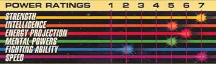

# Agilenizer
## A module for measuring skills

[](https://github.com/feross/standard)



Don't let the Agile methodology reduce your team to coarse and uninteresting indididual comparisons!

Rather than measuring how many "points" a person completes, or how much faster they tend to complete tasks, `Agilenizer` provides a statistical, skill-domain-driven analysis.

By defining `dimensions` to track, `Agilenizer` can match for those in your task title strings, allowing easy data digestion.

```javascript
  var agilenizer = require('agilenizer')

  var person = agilenizer.newIdentity({
    name: 'Dan', // Optional
    dimensions: ['Node', 'iOS', 'Android', 'UI', 'API'],
    caseInsensitive: false, // For matching dimensions
  })

  // Train agilenizer with past experience:
  person.completed(['Node', 'UI'], {
    taken: 3,
    expected: 2
  })

  // Internally, taken/expected becomes ratio:
  person.completed(['Node', 'API'], {ratio: 1.8})

  // Can also provide a string instead of array:
  person.completed('iOS UI-Whatever works!', {ratio: 0.25})
  person.completed('iOS API thingie!', {ratio: 0.5})
  person.completed('iOS UI: Special mission', {ratio: 0.5})
  person.completed(['iOS', 'API'], {ratio: 0.75})

  // At any point, the identity can generate projections:
  // The projection is a ratio, representing
  // what multiple of the time estimate this person
  // is likely to take.  Multiply it by the task estimate.
  var projection = person.guessFor('iOS UI Task')
  test.equals(projection, 0.375)

  // Since we set caseInsensitive, this also works:
  projection = person.guessFor('ios ui task')
  test.equals(projection, 0.375)

  // Persisting your trained identity is easy
  // AND memory efficient!
  var json = person.serialize()
  test.equals(typeof json, 'string')

  // Later on:
  var newPerson = agilenizer.newIdentity()
  newPerson.load(json)
```

## Roadmap

 - Track skill progression, to highlight growth, and encourage working outside specialized domains.